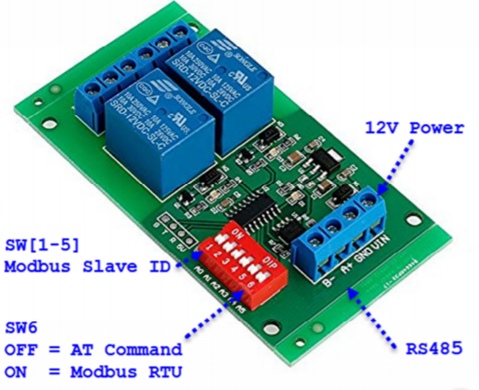

# s60030049modrelay
# ไม่ได้ทดลองจริง แต่จะขออธิบายการทำงานที่ได้ศึกษามาตามที่เข้าใจ
# อธิบายหลักการทำงาน Modbus RTU Relay

ใช้สำหรับสั่งงานควบคุมผ่านทางพอร์ตสื่อสารอนุกรมผ่านสัญญาณ RS485 แบบ Half Duplex ด้วย Protocol การ
สื่อสารแบบ Modbus RTU หรือ AT Command รองรับการเชื่อมต่อสื่อสารระยะไกลแบบ Multi-drop ตาม
มาตรฐาน RS485 สามารถเชื่อมต่ออุปกรณ์ร่วมกันในระบบบัสเดียวกันได้มากถึง 32 อุปกรณ์ โดยสามารถ
กําหนดค่า Slave Address ได้อิสระจาก Dip Switch มีคําสั่งรองรับการทํางานแบบ PLC ทั้งการสั่ง
ON/OFF โดยตรง และ Toggle และ Inter-Locking(ON1/OFF2 หรือ ON2/OFF1 หรือ OFF1/OFF2) หรือ
แบบ Momentary(ON เป็นเวลา 0.5 วินาทีแล้ว OFF เอง) และ Delay (ON เป็นเวลานานตามเวลาที่
กําหนดไว้แล้ว OFF เอง)

# คุณสมบัติ
1. ใช้กับแหล่งจ่ายไป 12VDC
2. สื่อสารด้วย RS485 Half Duplex กำหนด Slave Device ID ได้อิสระ 32 ตำแหน่งผ่าน Dip Switch 
3. มีคำสั่งรองรับการทำงานแบบ PLC
    - ON/OFF เป็นคำสั่งเปิดหรือสั่งปิด
    - Toggle เป็นการสั่งสลับการทำงานเป็นตรงข้าม
    - Latch (Inter-Locking) เป็นคำสั่ง ON1/OFF2 หรือ ON2/OFF1
    - Momentary เป็นการสั่ง ON 0.5 วินาที แล้ว OFF เองอัตโนมัติ
    - Delay เป็นการสั่ง ON เป็นเวลานานตามที่กำหนด (0-9999 วินาที) แล้ว OFF เองอัตโนมัติ
    - Read Status เป็นการสั่งอ่านสถานการณ์ ON/OFF
4. การเชื่อมต่อสื่อสารผ่านสัญญาณแบบ RS485 Half Duplex โดยสามารถเลือกการสั่งงานแบบ AT Command หรือ Modbus RTU Protocol
    o สามารถกําหนดค่า Slave Address ได้ 32 ตําแหน่ง(0-31 : 0x00-0x1F) จาก Dip Switch
    o Baudrate 9600bps, Data 8 Bit, None Parity, 1 Stop Bit 

# โหมดการทำงาน AT Command Mode
ในโหมดนี้ใช้การสื่อสารเป็น AT Command ด้วยรหัส ASCII โดยใช้รูปแบบคำสั่งเป็นอักขระ มี 7 รูปแบบคำสั่ง เมื่อบอร์ดรับคำสั่งจะมีการตอบรับการทำงานโดยการส่งค่าสถานะของรีเลย์ที่เปลี่ยนแปลงหลังจากการทำงานของคำสั่งนั้น 
กลับมาให้ มี 4 รูปแบบ คือ
    o Close1 หมายถึง Relay1 ปิด
    o Close2 หมายถึง Relay2 ปิด
    o Open1 หมายถึง Relay1 เปิด
    o Open2 หมายถึง Relay2 เปิด

# โหมดการทำงาน Modbus RTU Command Mode
ในโหมดนี้จะต้องกำหนดตำแหน่ง Dip Switch[6] ให้อยู่ตำแหน่ง ON ส่วน Dip Switch[1-5] จะใช้สำหรับกำหนดค่า Slave Device Address ระหว่าง 0x00 - 0x1F โดย Switch[1] แทน A0 , Switch[2] แทน A1 เรียงลำดับไปจนถึง Switch[5] แทน A4 โดยตำแหน่ง Switch ที่ ON จะมีค่าเป็น 1 และ Switch ที่ OFF จะมีค่าเป็น 0

ที่มารูป https://www.etteam.com/productI2C_RS485/MODBUS%20RTU%20RELAY2/%E0%B8%84%E0%B8%B9%E0%B9%88%E0%B8%A1%E0%B8%B7%E0%B8%ADModbusRTURelay2.pdf
